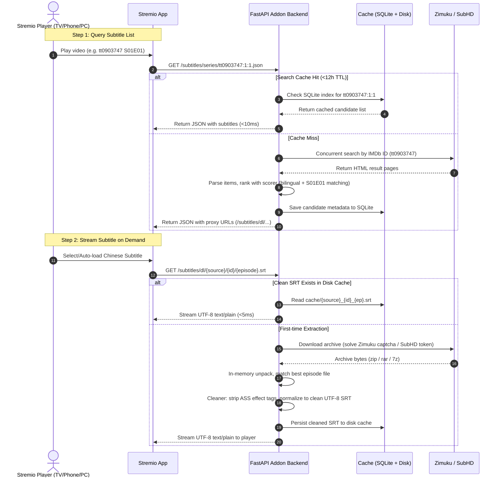

# Stremio Chinese Subtitle Addon (`stremio-zhsubtitle`) Architecture & Design Specification

> **Status**: Design Approved  
> **Target Project**: `stremio-zhsubtitle` (Dedicated Stremio Subtitle Addon for Zimuku & SubHD)  
> **Author & Facilitator**: Antigravity Brainstorming Session

---

## 1. Executive Summary & Understanding Lock

### 1.1 Purpose & Motivation
Stremio is an increasingly popular open-source media aggregator across Desktop, Android TV, Apple TV, iOS, and Web. However, existing subtitle addons (such as OpenSubtitles v3 or SubDL) have poor coverage, out-of-sync timings, or lack bilingual Chinese translations for newly released movies and TV shows.

`stremio-zhsubtitle` bridges this gap by acting as a specialized Stremio Addon that aggregates subtitles directly from China's two premier subtitle communities:
1. **Zimuku (`srtku.com`)**
2. **SubHD (`subhd.tv`)**

### 1.2 Target Audience & UX Principles
- **Target Audience**: All Chinese-speaking Stremio users across TV, Mobile, and Desktop.
- **Zero Configuration for End Users**: The service is hosted as a public online web service. Users simply visit the homepage and click one button to install it to their Stremio account without touching any server or code.
- **Zero Mojibake / Garbled Code**: Every subtitle is normalized to clean UTF-8 `.srt`, stripping all confusing ASS/SSA effect codes that break on TVs and mobile devices.

### 1.3 Key Constraints & Non-Goals
- **Non-Goal 1**: Does NOT scrape or stream video content; pure subtitle provider.
- **Non-Goal 2**: Does NOT support `.sup` (PGS image subtitles), as external HTTP image subtitles are unsupported by Stremio clients.
- **Non-Goal 3**: No complex user databases or login accounts; stateless and privacy-preserving.

---

## 2. Decision Log

| Decision ID | Topic | Selected Decision | Alternatives Considered | Rationale |
| :--- | :--- | :--- | :--- | :--- |
| **DEC-001** | **Deployment Model** | **Public Online Addon (Free Cloud)** | Local desktop companion / Private VPS | Allows 1-click install for TV and mobile users without requiring local servers or technical knowledge. |
| **DEC-002** | **Backend Stack** | **Python 3.11+ & FastAPI** | Node.js with `stremio-addon-sdk` | 100% direct reuse of `mpv-zhsubtitle`'s verified BMP captcha solver, SubHD token flow, and archive extraction logic. |
| **DEC-003** | **Extraction Timing** | **Lazy On-Demand Stream Extraction** | Eager bulk extraction during search | Keeps search latency under 500ms to avoid Stremio's 3–5s client timeout; unzips only the subtitle the user actually plays. |
| **DEC-004** | **Subtitle Cleaning** | **Standardize all to UTF-8 SRT** | Pass raw ASS/SSA or multi-format | Fixes Android TV and Web rendering bugs where raw ASS styling tags (`{\pos...}`) pollute on-screen dialogue. |
| **DEC-005** | **Caching System** | **Two-tier: SQLite (12h TTL) + Disk LRU** | In-memory only / Redis / Pass-through | Reduces upstream crawler requests by 90%+, protecting Zimuku/SubHD against IP bans and achieving <10ms response on cached titles. |
| **DEC-006** | **Web Interface** | **Single-Page Web UI (`/configure`)** | Headless API only | Provides the critical 1-click `stremio://` protocol install button and customizable language preference toggles. |
| **DEC-007** | **Free Hosting Target**| **Hugging Face Spaces (Docker Space)** | Render / Koyeb / Vercel | Free 2 vCPU / 16GB RAM / 50GB storage, permanent free HTTPS domain, no credit card required, avoid cold-start timeouts via keepalive ping. |

---

## 3. System Architecture & Component Design

### 3.1 Directory Structure
```text
stremio-zhsubtitle/
├── app/
│   ├── main.py              # FastAPI app, route mounting, CORS middleware
│   ├── config.py            # Environment configurations (CACHE_DIR, PORT, UPSTREAM_PROXY)
│   ├── api/
│   │   ├── manifest.py      # Stremio Addon manifest (/manifest.json, /:config/manifest.json)
│   │   ├── subtitles.py     # Subtitle query endpoint (/subtitles/:type/:id.json)
│   │   ├── download.py      # On-demand extraction & streaming (/subtitles/dl/...)
│   │   └── configure.py     # Web configuration & 1-click install router (/, /configure)
│   ├── providers/
│   │   ├── base.py          # Abstract BaseProvider interface
│   │   ├── zimuku.py        # Zimuku scraping + 4-digit BMP pixel captcha solver
│   │   └── subhd.py         # SubHD scraping + AJAX token download parser
│   ├── core/
│   │   ├── extractor.py     # In-memory/temp unpacker (zip, rar, 7z) & episode matcher
│   │   ├── cleaner.py       # ASS/SSA/VTT tag stripping and UTF-8 SRT converter
│   │   └── scorer.py        # Subtitle scoring model (bilingual preference, season/ep match)
│   └── cache/
│       └── manager.py       # SQLite search cache (12h TTL) + Disk file LRU cache
├── static/
│   └── index.html           # Dark-themed modern responsive UI for 1-click installation
├── Dockerfile               # Multi-stage lightweight Dockerfile (python:3.11-slim + p7zip)
├── docker-compose.yml       # Local and private VPS deployment config
├── requirements.txt         # Dependencies list (fastapi, uvicorn, httpx, bs4, py7zr, rarfile)
└── README.md                # Deployment and usage instructions
```

---

## 4. End-to-End Data Flow



---

## 5. Technical Details & Algorithms

### 5.1 Subtitle Normalization Engine (`cleaner.py`)
1. **Charset Auto-Detection**:
   - Probe encodings (`utf-8`, `gb18030`, `big5`).
   - Normalize strictly to UTF-8 without BOM.
2. **ASS / SSA Dialogue Sanitization**:
   - Filter out `Comment:` headers and vector drawing commands (`{\p1}...{\p0}`).
   - Regex strip styling tags: `re.sub(r"\{[^\}]*\}", "", dialogue_text)`.
   - Normalize newline markers: convert `\N` and `\n` to standard linebreaks.
   - Convert ASS centiseconds timestamp (`0:01:23.45`) to standard SRT milliseconds (`00:01:23,450`).

### 5.2 Anti-Scraping & Resilience Mechanisms
1. **In-Memory Captcha Cracking**:
   - Integrates pure-Python pixel matching for Zimuku's 4-digit BMP captchas (0 external API costs, 99%+ recognition rate).
2. **Single-Flight Request Mutex**:
   - Simultaneous user queries for the exact same IMDb ID are coalesced into a single upstream request, preventing duplicate crawler bursts.
3. **Dual-Source Auto-Failover**:
   - Queries SubHD and Zimuku in parallel via `asyncio.gather(return_exceptions=True)`. If either fails, the surviving provider serves the user without interruption.
4. **Proxy Support**:
   - Optional `UPSTREAM_PROXY` environment variable for seamless deployment on foreign datacenters.

---

## 6. Web Installation & Configuration UI (`/configure`)
- **Visuals**: Modern Stremio dark-slate palette with responsive cards.
- **Deep-linking**:
  - Primary button: **[一键安装到 Stremio]** (`stremio://domain/manifest.json`).
  - Secondary button: **[复制 Manifest 链接]** for TV clipboard pasting.
- **User Toggles**:
  - Language: Bilingual First (Default) / Simplified Only / Traditional Only.
  - Max items: 5 / 8 (Default) / 10.
  - Dynamically encodes configuration into base64 manifest route `/:config/manifest.json`.

---

## 7. Deployment Guide (Zero-Cost Hosting)

### 7.1 Hugging Face Spaces (Docker)
1. Create a new Space on [Hugging Face](https://huggingface.co/spaces) with SDK: **Docker**.
2. Push repository code to the Space's Git remote.
3. Hugging Face automatically builds the container and provides a public HTTPS URL:
   `https://[your-user]-[space-name].hf.space`.
4. Add the URL to a free uptime monitor (e.g. UptimeRobot) targeting `/` every 10 minutes to prevent container sleep.

### 7.2 Docker Compose (Self-Hosted / VPS)
```yaml
version: '3.8'

services:
  stremio-zhsubtitle:
    image: stremio-zhsubtitle:latest
    build: .
    container_name: stremio-zhsubtitle
    restart: unless-stopped
    ports:
      - "7000:7000"
    environment:
      - PORT=7000
      - CACHE_DIR=/app/data/cache
      - UPSTREAM_PROXY=""
    volumes:
      - ./data:/app/data
```
